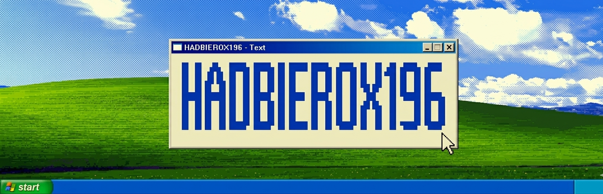

  

## About Me

I'M HASSAN FAROOQ, CURRENTLY PURSUING MBBS AT SARGODHA MEDICAL COLLEGE. ALONG WITH MY MEDICAL STUDIES, I'M ACTIVELY ENGAGED IN RESEARCH WORK, WEB DEVELOPMENT PROJECTS, AND GRAPHIC DESIGΝING, WΗEREΕ Ι BLEND CREATIVITY WITH TECHNICAL SKILLS. MY GOAL IS TO INTEGRATE MEDICINE, TECHNOLOGY, AND DESIGN TO DEVELOP INNOVATIVE AND VISUALLY IMPACTFUL SOLUTIONS THAT

MAKE A DIFFERENCE

---

## Skills

  
  
  
  
  
  
  
  
  
  
  
  
  
  
  
  
  
  
  
  
  
  
  
  
  
  
  
  

---

## Stats

  
  &nbsp;
  

  

---

## Contributions

  

---

## Connect

  
  &nbsp;
  
  &nbsp;
  

  

